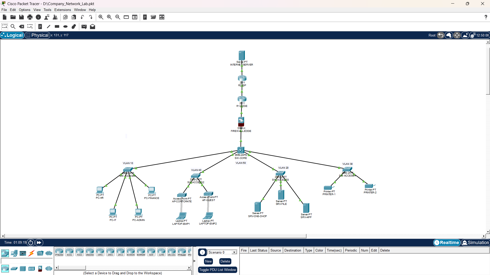

# Company Office Network Design
A Cisco Packet Tracer project that simulates a company office network using routers, Layer 2/Layer 3 switches, servers, printers, wireless access points, and an ASA firewall

## Network Topology

