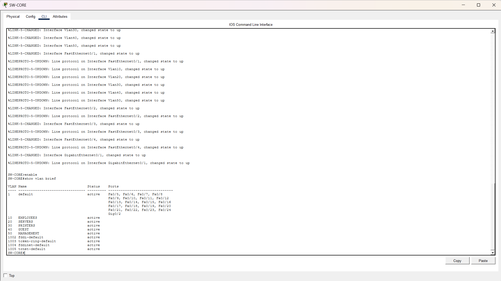
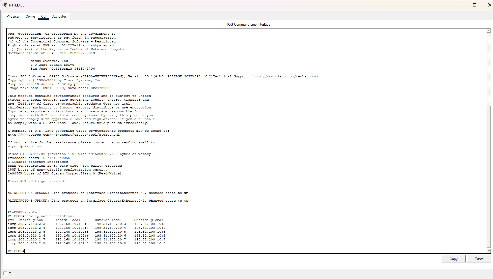
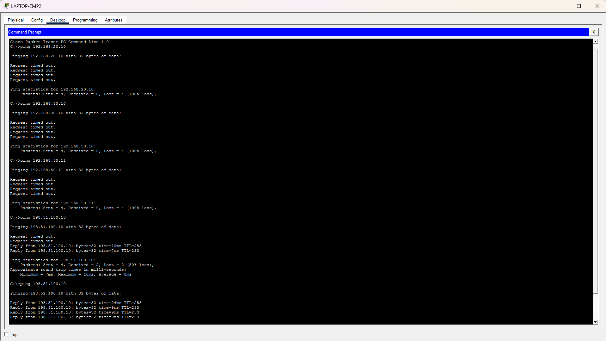
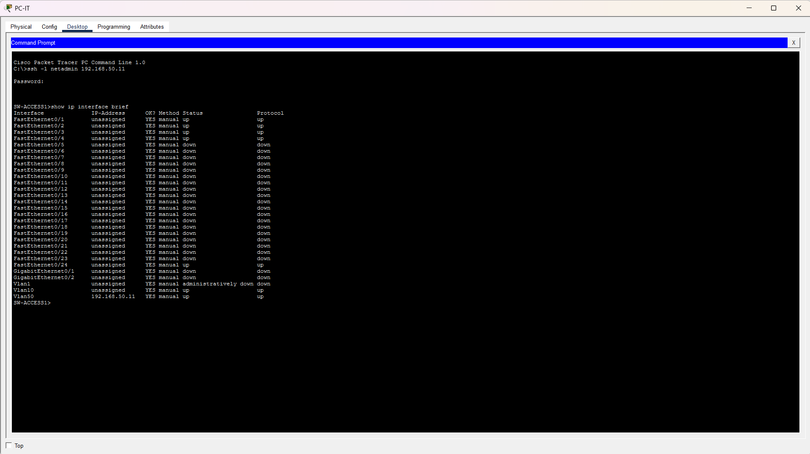
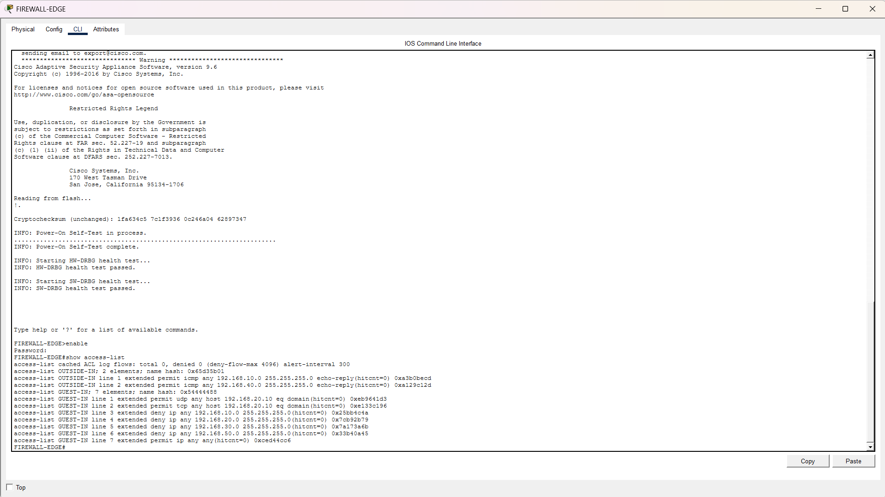

# Company Office Network Design
A Cisco Packet Tracer project that simulates a company office network using routers, Layer 2/Layer 3 switches, servers, printers, wireless access points, and an ASA firewall

## Network Topology

## Features Implemented
- VLAN segmentation
- Access and trunk port configuration
- Inter-VLAN routing
- IPv4 addressing
- DHCP and DNS services
- DHCP relay
- Static routing
- Corporate and guest Wi-Fi segmentation
- NAT/PAT
- ACL-based access control
- ASA firewall integration and security policies
- Management VLAN
- SSH remote management

## VLAN Design
| VLAN |     Name       |     Network     |
|------|----------------|-----------------|
|  10  |    Employees   | 192.168.10.0/24 |
|  20  |    Servers     | 192.168.20.0/24 |
|  30  |    Printers    | 192.168.30.0/24 |
|  40  |    Guest       | 192.168.40.0/24 |
|  50  |    Management  | 192.168.50.0/24 |

## Security
The network separates employee, server, printer, guest, and management traffic using VLANs and ACLs. Guest Wi-Fi is isolated from internal company resources while retaining Internet access, and SSH is used for secure remote management of network devices.

## Testing and Verification
### VLAN Configuration
Verified VLANs for employees, servers, printers, guests, and network management.

### NAT/PAT
Verified NAT/PAT translation from private company IP addresses to the edge router's outside IP address.

### Guest Network Security
Verified that guest Wi-Fi can access the simulated Internet while access to servers, printers, and management devices is blocked.

### SSH Remote Management
Verified secure remote management of network switches from the IT workstation using SSH.

### Firewall Security Policy
Configured firewall rules to control traffic between the company network, guest network, and simulated Internet.

